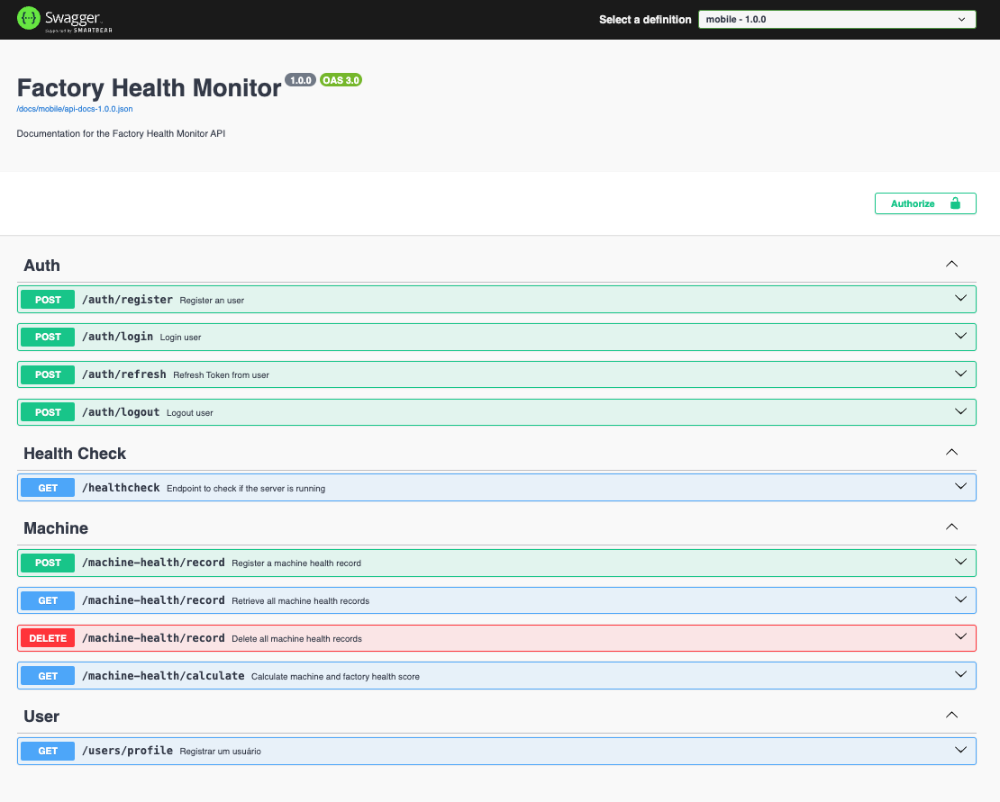

# Factory Health Monitor - Authentication, State Management, and Persistence

## Overview

The application is a tool for evaluating the health of various machines in an automobile manufacturing plant. This plant features a range of machines, each with specific data points that you will use to assess the condition of the production process.

[Original Challenge README.md](./README-challenge)

## Backend

The backend is a Node.js API built with Express.js and Prisma ORM. The API provides endpoints for user authentication, machine health data, and user data. The API is connected to a SQL Lite database for data persistence.

To run the backend, run the following commands:

```bash
   cd backend && yarn install
```

Then run the migrations:

```bash
   npx prisma migrate dev
```

And finally run the backend:

```bash
   yarn start
```

### API Documentation

We have the OpenAPI documentation for the API in the `backend` folder. You can view the documentation by running the backend and navigating to `http://localhost:3001/docs` to access the Swagger docs.

[](http://localhost:3001/docs)

## Mobile

The mobile app is a React Native app built with Expo. The app provides a user interface for logging in, viewing machine health data, and viewing user data.

Follow the setup requirements at [Expo Guide](https://docs.expo.dev/get-started/installation/).

To run the mobile, run the following commands:

```bash
   cd native-app && yarn install && yarn start
```

## Features

- [x] Authentication (JWT 5min expiry and refresh token 8h expiry)
- [x] Session Management
- [x] Data State Management using React Query
- [x] Persistence Layer on the Backend (Prisma ORM + SQL Lite)
- [x] Record Machine Health Data on Backend
- [ ] Change to Production Database
- [ ] Implement a section to show the history of scores with trends over time.
- [ ] Include visualizations such as charts or graphs to represent the trends in machine health scores.
- [ ] Add more tests
- [ ] Add more features

### Machines and Their Variables

1. **Welding Robots**

   - Welding Robot Error Rate
   - Welding Arm Vibration Level
   - Electrode Wear
   - Gas Shielding Pressure
   - Welding Wire Feed Rate
   - Arc Stability
   - Weld Seam Width
   - Cooling System Efficiency

2. **Painting Stations**

   - Paint Flow Rate
   - Paint Pressure
   - Paint Color Consistency
   - Paint Nozzle Condition

3. **Assembly Lines**

   - Part Alignment Accuracy
   - Assembly Line Speed
   - Component Fitting Tolerance
   - Conveyor Belt Speed

4. **Quality Control Stations**
   - Inspection Camera Calibration
   - Inspection Light Intensity
   - Inspection Software Version
   - Inspection Criteria Settings